# Codebase Documentation

> [!info] Overview
> This document provides a comprehensive overview of the systems driving the VR Dragon Boss Fight experience. It includes descriptions of the purpose and player experience for each class, along with UML diagrams outlining their public API.

## The Message Systems
This codebase relies on two primary message systems to decouple components, cleanly separated by their scope (spatial vs state):

1. **PixelCrushers MessageSystem (Strictly Spatial/Spline):** Used exclusively for spline-based activities and spatial events where the object's position on a spline is critical (e.g., `"DragonReachedCrystal"`, `"DragonLeftCrystal"`, `"CrystalDestroyed"`).
2. **EventManager (Standard C# Actions):** A custom static `EventManager` (along with direct C# Actions and UnityEvents) used for all global combat, game state, UI communications, and AI triggers that do not rely on splines (e.g., `OnMinionUnderFire`, `OnDragonNeedsSupport`, `OnPlayerShootsBoss`).

---

## Dragon as a Creature

### `DragonBrain`

**Purpose:** The core tactical decision-maker for the Dragon. Implements a Utility Scoring system to evaluate and transition between states (Attack, Defend, Roam, etc.) based on health, minions, and environmental factors.

**Player Experience:** The player perceives a highly intelligent, reactive opponent. When the player shoots its minions, it might aggressively swoop down; when it loses too many segments, it will retreat in a panic to heal.


**Core Logic & Utility Scoring (Desire Table):**
The `DragonBrain` evaluates tactical priorities dynamically on a continuous, frame-by-frame basis, allowing it to break away from paths mid-travel based on real-time priorities. This system calculates "desire scores" across three core behavioral pillars: Defend Self, Execute Grid Strategy, and Direct Minions.

*Live Desire Table (Custom Editor Visualization):*
We have implemented a custom Unity Editor script (`Editor/DragonBrainEditor.cs`) that visualizes these exact values dynamically in the Inspector during Play Mode, updating constantly. It sorts by the highest score, illustrating the AI's internal logic.

| State (`CurrentState`) | Personality Pillar | Condition / Influences | Desire Score |
| :--- | :--- | :--- | :--- |
| `FleeToHeal` | **Defend Self** | **Absolute Priority:** Triggers immediately if `OnHealingImperativeReached` fires (critical segments lost). Scales between 0 and 50 based on missing segments, or spikes to `100f` if absolute retreat is needed. | `0f` to `100f` |
| `DefendCrystal` | **Defend Self** | Commands the Dragon to route directly to a crystal's observation spline to regenerate. | Active during Heal |
| `DefendMinions`| **Direct Minions** | Triggers when the `"MinionUnderFire"` message is intercepted or player is blinded. The Dragon actively moves to shield or command its vulnerable minion waves. | `75f` or `0f` |
| `TopplePillar` | **Execute Grid Strategy** | Identifies a `ToppleItem` closest to the player's predicted movement line to slice away walkable area and close up safe boundaries. | `60f` or `0f` |
| `DenyArea` | **Execute Grid Strategy** | **Baseline Strategic Aggression:** Evaluates open plane space to drop hazards (fire fields) ahead of the player's vector, constricting safe ground and applying debuffs. | `35f` or `0f` |
| `AttackPlayer` | **Baseline** | Standard physical or projectile engagement if grid strategy is on cooldown. Active if the player is alive/found. | `40f` or `0f` |
| `Roam`         | **Fallback** | Default evaluation state. | `10f` |

**The Tactical Feedback Loop (Player Counter-Play):**
The Dragon does not possess an absolute invulnerability state; the player can actively manipulate this Desire Table to stop the Dragon's "Grid Strategy" (Area Denial):
*   **Attack a Crystal:** If the player attacks a crystal, the Dragon's "Defend Self" desire spikes. It drops its Area Denial priority to defend the crystal, giving the player breathing room.
*   **Attack Minions:** Every living minion grants the Dragon a cumulative +2% strength augment. Killing minions in their exposed transit window weakens the Dragon, and forces the AI into `DefendMinions` mode to protect its remaining forces.
*   **Prevent Enclosure:** The player must not stand in dark fire hazards, which apply mechanical penalties (weaker power shots, visual blindness overlay). They must keep the Dragon on the back foot to prevent the absolute territory game-over win condition.

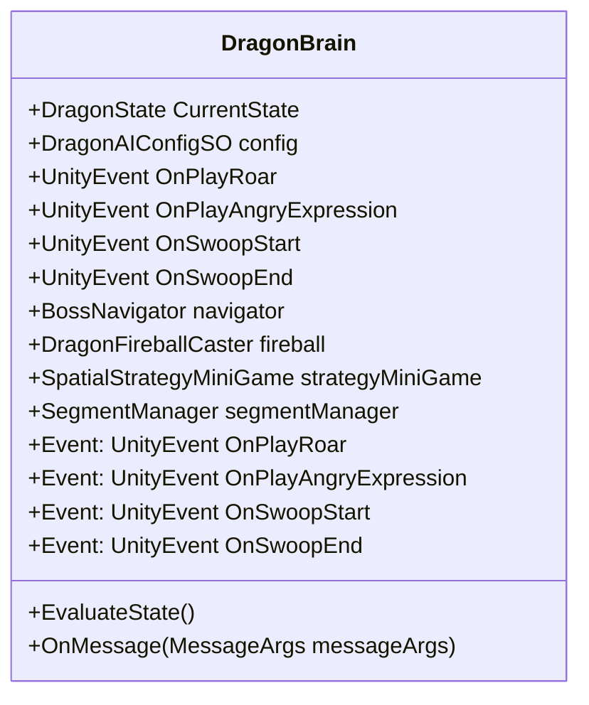

---

### `DragonSegment`

**Purpose:** Represents an individual physical, destructible piece of the Dragon's body. Receives damage via the `IArrowTarget` interface and communicates destruction to the `SegmentManager`.

**Player Experience:** The player aims at specific body parts of the snake-like dragon. Hitting them provides visceral feedback (arrows sticking, visual effects), and destroying them physically shortens the dragon and weakens it.

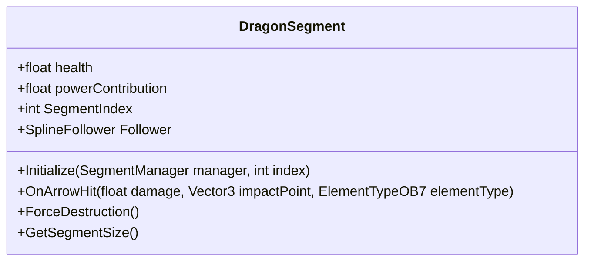

---

### `DragonSnakeMovementStyle`

**Purpose:** Handles the procedural, follow-the-leader physical movement of the dragon's body segments along splines, ensuring they slither and bank smoothly around curves.

**Player Experience:** The dragon moves fluidly and realistically through the air, curving around pillars and diving gracefully, rather than feeling rigid or mechanical.

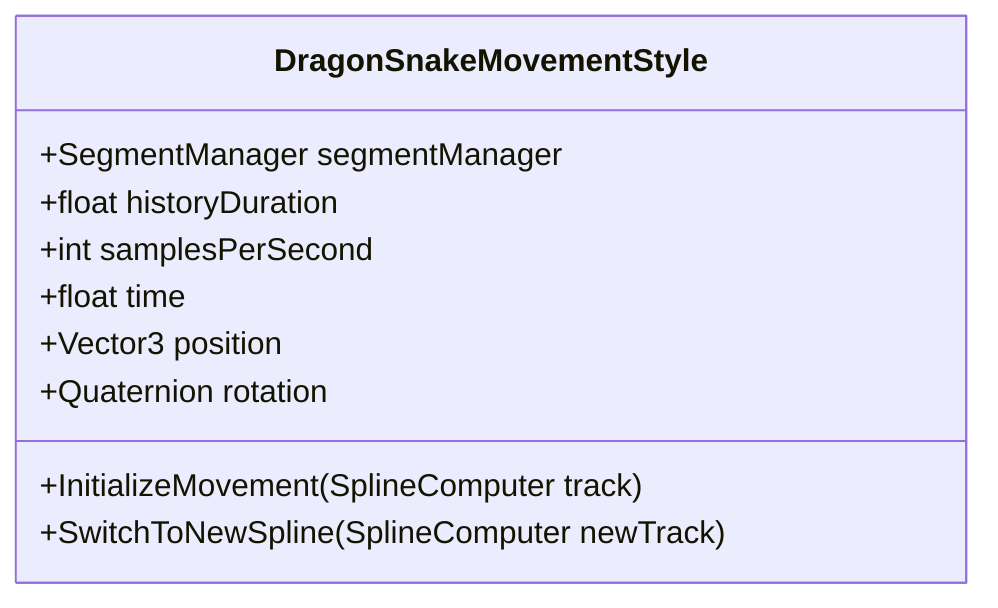

---

### `DragonFireballCaster`

**Purpose:** Manages the dragon's offensive capabilities, including shooting fireballs or other elemental projectiles at the player or the environment.

**Player Experience:** The player must constantly stay on the move, dodging incoming elemental attacks that the dragon breathes down upon the arena.

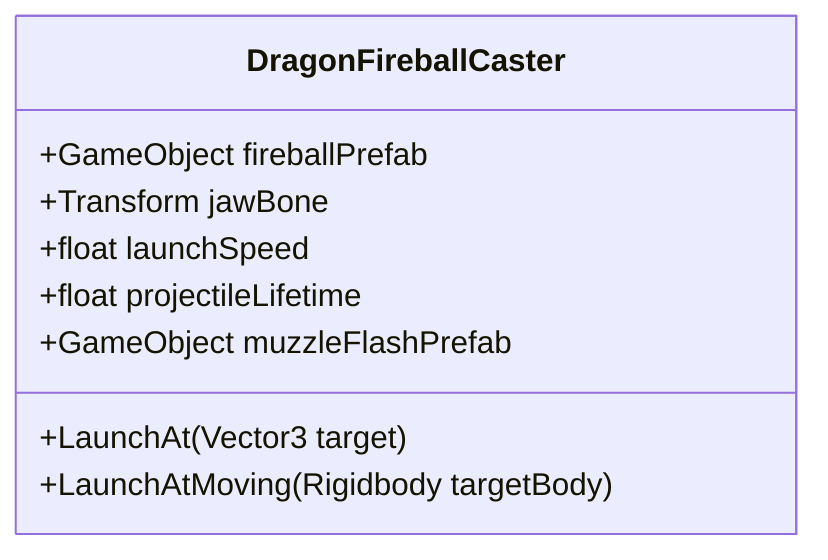

---

### `DragonAIConfigSO`

**Purpose:** A ScriptableObject containing all the tunable variables and thresholds for the Dragon's AI, such as health scaling, regeneration rates, and aggro timers.

**Player Experience:** While invisible to the player directly, this configuration ensures the difficulty curve feels balanced and allows designers to tweak the fight's intensity without altering code.

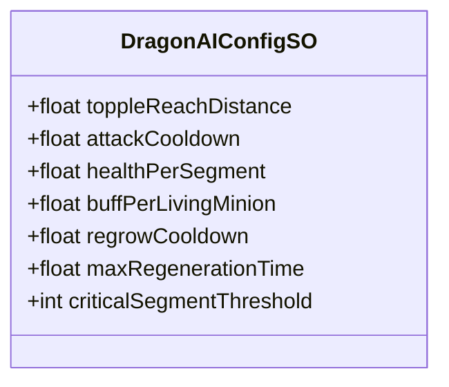

---

### `BossNavigator`

**Purpose:** Handles the macro-level pathfinding and navigation for the boss, directing it between different splines, cover points, and the healing crystal based on brain commands.

**Player Experience:** The player sees the dragon moving purposefully between different tactical vantage points, retreating to specific areas, or dynamically pathing to intercept the player.

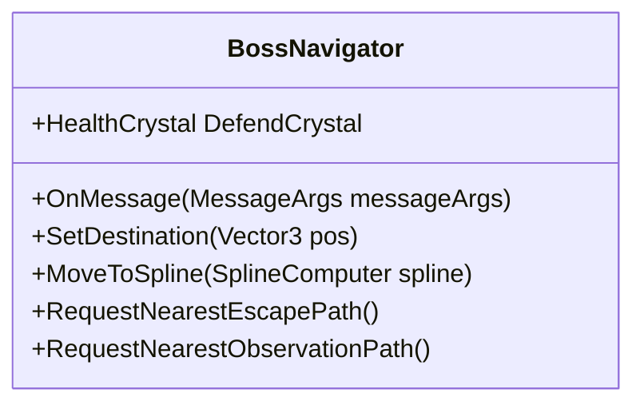

---

### `BossStatsAndHealth`

**Purpose:** The primary vital statistics container for the boss. Tracks aggregate health, stamina, and broadcasts critical thresholds via global events.

**Player Experience:** As the player deals damage, they chip away at the total health pool, triggering phase transitions, enraged states, or ultimate defeat.

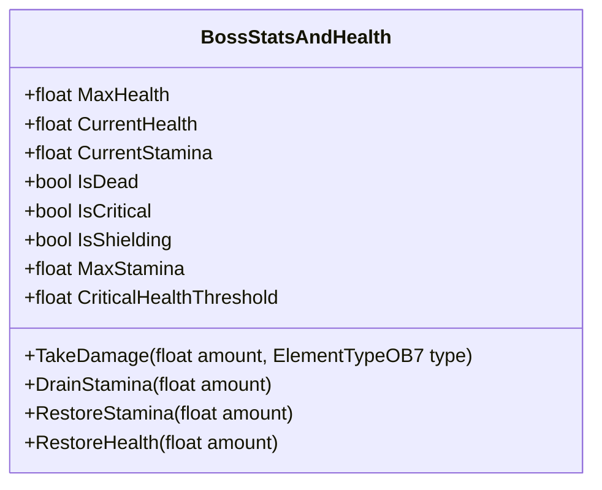

---

### `BossPathManager`

**Purpose:** A static or global manager that keeps track of all available splines and navigation paths the boss can traverse within the level.

**Player Experience:** Supports the rich environmental movement, ensuring the dragon always has a valid, interesting flight path around the arena structure.

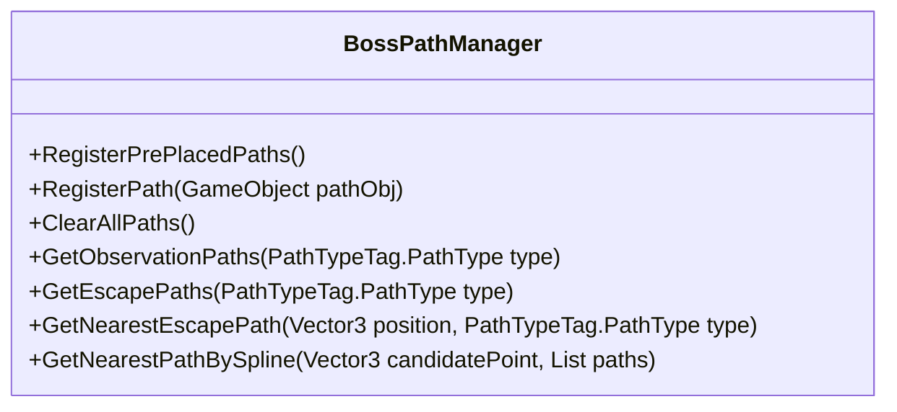

---

### `SegmentManager`

**Purpose:** Acts as the intermediary between the individual `DragonSegment` body parts and the `DragonBrain`. It tracks the total count of living segments and calculates when the dragon is critically wounded.

**Player Experience:** The player realizes that destroying enough segments forces the dragon to change its behavior entirely, retreating defensively instead of pressing the attack.


**Core Logic & Event Hooks:**
`SegmentManager` acts as the physical tracker for the dragon's body size, separating visual movement from tactical calculations.

*   **Destruction Pipeline:** When a `DragonSegment` reaches 0 health, it sends `"SegmentDestroyed"` via `MessageSystem`. The `SegmentManager` intercepts this, removes the segment from the tracking list, recalculates spacing to trigger gap closure (allowing the snake movement script to seamlessly stitch the body back together), and finally broadcasts the `OnSegmentLost` and `OnSegmentCountChanged` C# Actions to alert the `DragonBrain`.
*   **Healing Imperative Evaluation:** After every lost segment, it evaluates the `criticalSegmentThreshold` (from `DragonAIConfigSO`). If the remaining living segments fall below this threshold, it invokes `OnHealingImperativeReached`, triggering the `DragonBrain`'s retreat response.
*   **Regeneration Handling:** While near the crystal (tracked via `"DragonReachedCrystal"` and `"DragonLeftCrystal"` PixelCrushers messages), the manager slowly regrows segments one by one based on `regrowCooldown`. Once the max segment count is reached, it fires `OnFullyHealed`.

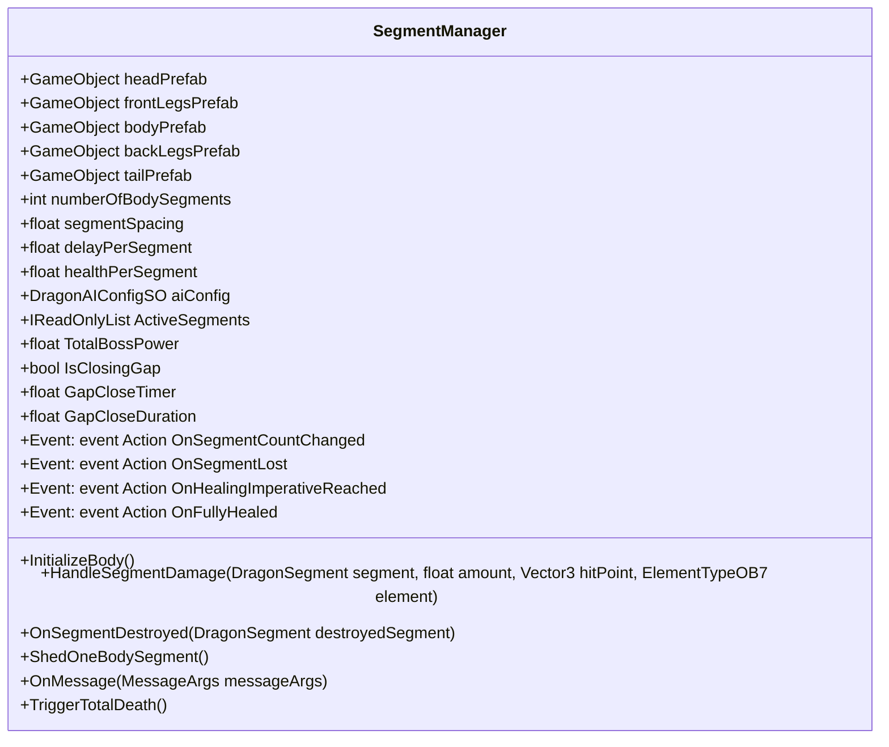

---

## The Environment

### `GameBoard`

**Purpose:** The absolute spatial vector and matrix calculation engine for the arena. Manages a 2D/3D grid, tracks hazards, and evaluates player bounds.

**Player Experience:** Provides the foundational physics and logic grid that allows hazards and ground effects to interact predictably with the player's movement space.

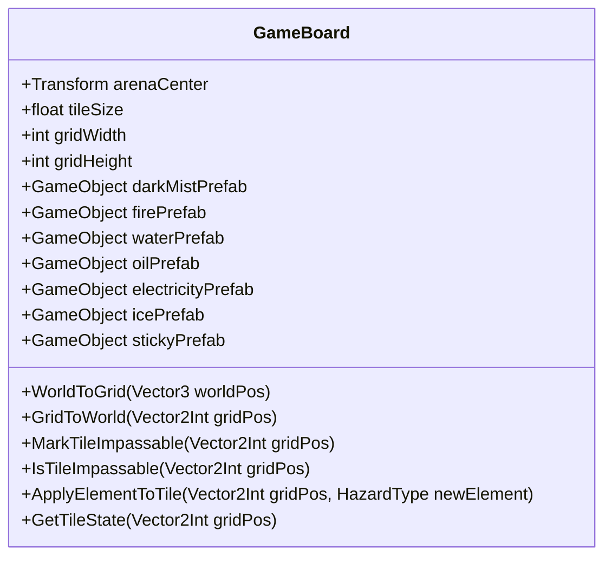

---

### `GroundHazard`

**Purpose:** Represents an environmental trap or elemental danger zone on the GameBoard. Implements `IArrowTarget` to allow player interactions (e.g., shooting a water hazard with ice to freeze it).

**Player Experience:** The player must navigate a dangerous floor, avoiding fire or sticky patches, but can also use their elemental arrows to cleverly neutralize or alter these hazards.

**Core Logic:**
Handles the instantiation and radius math of expanding dark/spirit fire particle fields.
*   **Radius Expansion:** It targets coordinates ahead of the player's vector, scaling the particle fields' diameters over time to constrict safe ground.
*   **Mechanical Penalty:** It tracks whether the player's position falls within the active zone. If true, it applies debuffs: weakening the player's power shots and triggering a visual blindness overlay (`VRHeadsetStickyBlindness`) that completely hides the positions of forming minion waves in the outer arena.

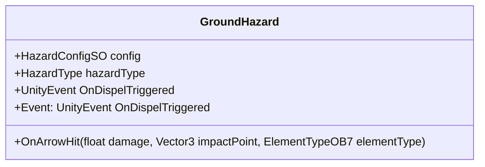

---

### `CoverPoint`

**Purpose:** Defines a tactical location in the environment. Can be commanded by the `MessageSystem` to release hidden minions when the dragon requires support.

**Player Experience:** The environment feels alive; when the dragon roars for help, enemies pour out of specific crevices or doorways, changing the flow of the battle.


**Core Logic & Event Hooks:**
`CoverPoint` acts as a tactical staging ground for minions before they enter active combat.

*   **Capacity Trigger:** When minions reach the cover point, they register themselves. If the point reaches its defined `capacity`, it automatically triggers all hiding minions to enter their charge/attack state.
*   **Dragon Synergy:** It actively listens for the `"DragonNeedsSupport"` message via the `PixelCrushers` message system. When the Dragon fires this message (often in response to losing segments or the player being blinded), the `CoverPoint` instantly overrides its capacity wait and forces all currently hiding minions to attack the player.

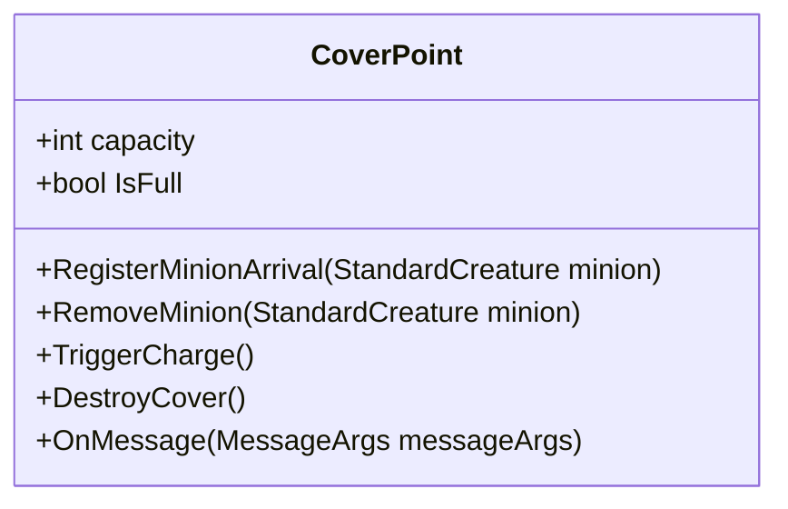

---

### `ToppleItem`

**Purpose:** Represents a large environmental object (like a pillar) that the dragon can knock down to create hazards or block the player's path.

**Player Experience:** The player experiences explosive, arena-altering destruction. The safe zones they relied on might suddenly be crushed by a falling pillar.

**Core Logic:**
`ToppleItem` structures are actively targeted by the Dragon's AI to cut off escape routes. The strategy system calculates which `ToppleItem` is closest to the player's predicted movement line and tips it over onto the plane to slice away walkable area and close up safe operational boundaries.

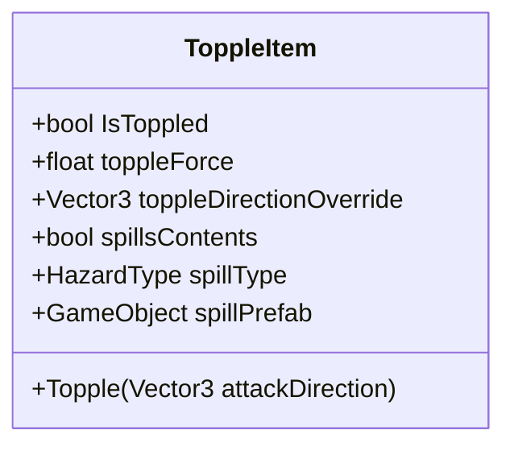

---

### `HazardConfigSO`

**Purpose:** A configuration asset containing properties for different environmental hazards, such as damage over time, slow amounts, and elemental interactions.

**Player Experience:** Ensures that fire burns at a consistent rate and sticky mud slows the player down effectively, providing clear and expected consequences.

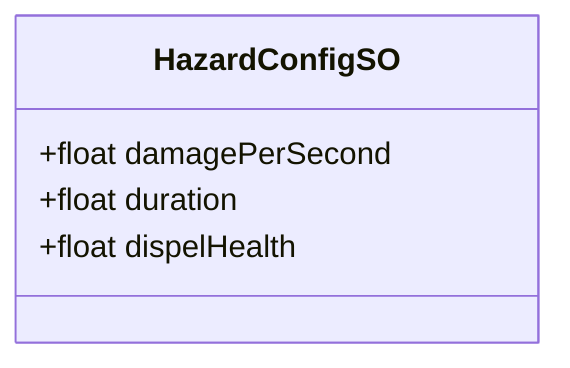

---

## Minigames

### `SpatialStrategyMiniGame`

**Purpose:** Manages a specific sub-system or puzzle phase within the battle that requires spatial reasoning or strategic placement.

**Player Experience:** Breaks up the standard combat loop, challenging the player to think tactically about positioning or solve a quick puzzle under pressure.

**Core Logic & Spatial Enclosure:**
The strategy minigame manages an aggressive game of physical enclosure on a continuous, flat 3D plane.
*   **Grid Math:** It evaluates the remaining open plane space and calculates coordinates ahead of the player's movement vector.
*   **Herding the Player:** It commands the Dragon to place hazards (dark/spirit fire fields) thoughtfully to trap the player, limit their options, and intentionally herd them into disadvantageous quadrants.
*   **Absolute Territory Win Condition:** It tracks the overall game-over countdown. If the player fails to clear the arena before the timer expires, this class floods the plane with dark fire and toppled items until no safe coordinates remain, resulting in a game over.

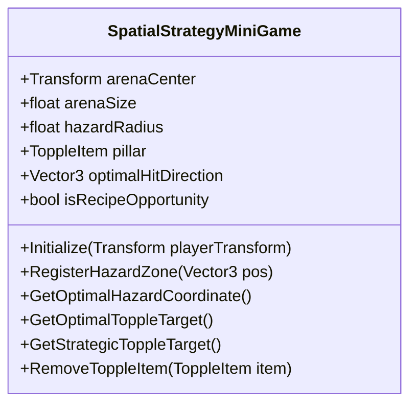

---

## Levers & Interactables

### `PuzzleLever`

**Purpose:** An interactable object that implements `IArrowTarget`. When shot, it triggers environmental changes, minigame states, or unlocks new areas.

**Player Experience:** The player uses their archery skills not just for combat, but to actively manipulate the environment, shooting distant switches to open gates or trigger traps.

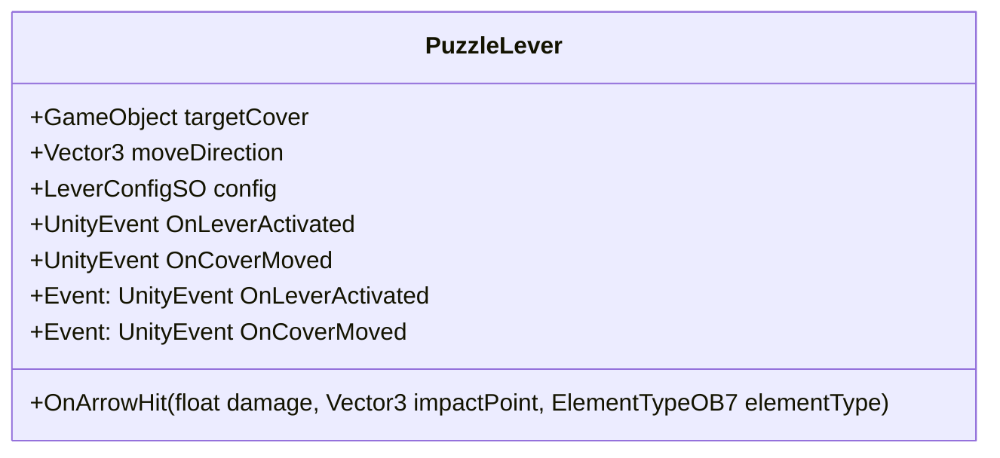

---

### `LeverConfigSO`

**Purpose:** Stores the configuration data for levers, including required arrow elements and activation delays.

**Player Experience:** Provides variety in puzzle solving; the player must quickly observe a lever's color and switch to the correct elemental arrow to activate it.

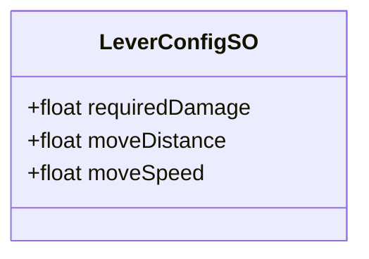

---

## Minions & Hazards

### `StandardCreature`

**Purpose:** The baseline script for grunt enemies. Implements elemental resistances, health, and `IArrowTarget` to receive damage.

**Player Experience:** The player engages in fast-paced combat with lesser enemies, exploiting their elemental weaknesses (e.g., using fire arrows on ice minions) for maximum effect.

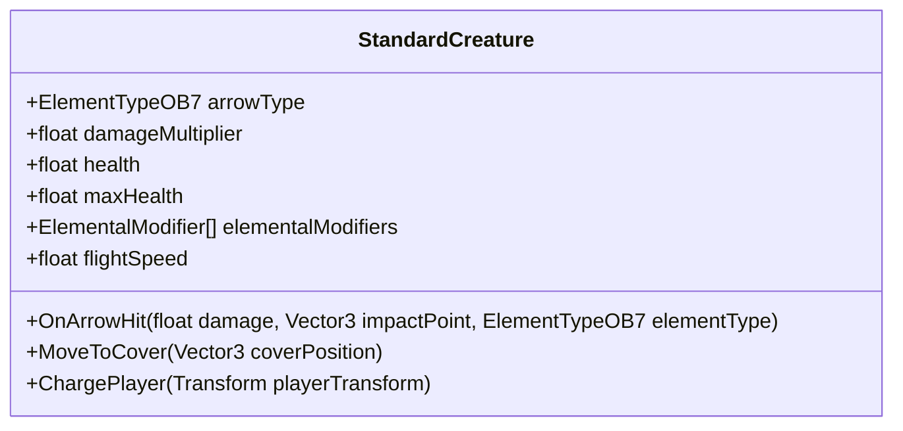

---

### `MinionManager`

**Purpose:** Oversees the spawning, lifecycle, and pooling of standard creatures in the arena.

**Player Experience:** Ensures a steady, challenging flow of enemies without overwhelming the game engine, keeping the arena populated with threats.

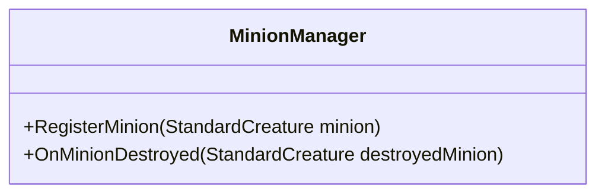

---


---

## System / Core

### `EventManager`

**Purpose:** A static C# event hub dedicated strictly to combat and global game state events. It completely replaces PixelCrushers for any logic that doesn't involve moving along a spline.

**Player Experience:** Ensures that when the player shoots the boss, kills a minion, or triggers a wave, the tactical AI and UI respond instantly and reliably without routing through spatial math systems.

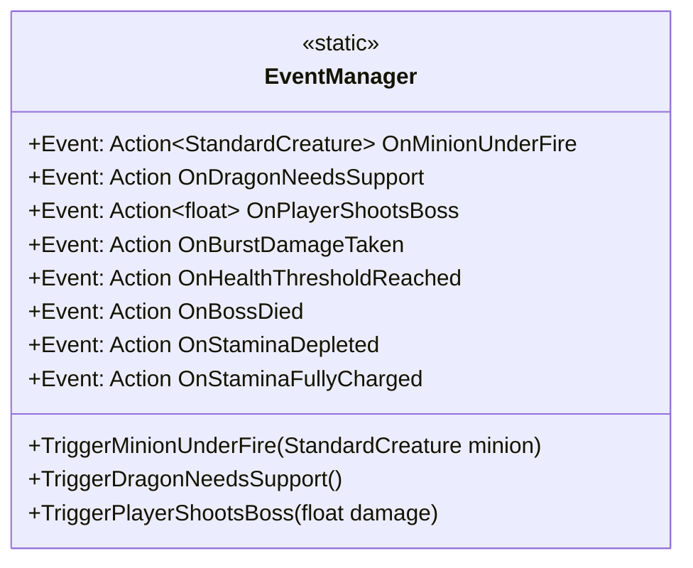

## System / Progression & UI

### `LevelProgressionManager`

**Purpose:** The overarching state machine for a level. Handles transitions between waves, intermissions, and campaign completion.

**Player Experience:** The player experiences a structured, cohesive encounter. The fight escalates through clear phases, punctuated by brief moments of respite or narrative events.

```mermaid
classDiagram
    class LevelProgressionManager {
        +float countdownDuration
        +float victoryDelay
        +Event: event Action<GameState> OnStateChanged
        +Event: event Action<LevelConfigSO> OnLevelIntroReady
        +Event: event Action<LevelConfigSO, LevelConfigSO> OnLevelOutroReady
        +Event: event Action<WaveData, int, int> OnWaveAnnounced
        +Event: event Action<float> OnCountdownUpdated
        +Event: event Action OnCampaignComplete
        +Event: event Action<LevelConfigSO, int> OnWaveStartRequested
        +ReceiveGongHit()
        +NotifyBossWaveStarted()
        +ReceiveWaveCompleted()
        +ReceiveBossDefeated()
    }
```

---

### `CharacterConfigBase`

**Purpose:** A foundational data structure that defines common properties for both minions and the boss, such as spawn delays and offsets.

**Player Experience:** Ensures that all enemy entities adhere to a unified set of basic behaviors during their initialization phase, preventing unpredictable spawning anomalies.

```mermaid
classDiagram
    class CharacterConfigBase {
        +float spawnDelay
        +Vector3 spawnPositionOffset
        +ElementTypeOB7 requiredArrowElement
        +GameObject prefab
        +GameObject spawnPointPrefab
        +TargetMovementType movementType
        +GameObject movementAssetPrefab
        +GameObject prefab
        +GameObject spawnPointPrefab
        +string waveName
        +string waveAnnouncementText
        +WaveProgressionType progressionType
        +float waveDuration
        +string levelName
        +string levelIntroText
        +string levelOutroText
        +string minionsFolderPath
        +string bossesFolderPath
        +string pathsFolderPath
        +string ObservationEscapeFolderPath
    }
```

---

### `WaveSpawner`

**Purpose:** Reads `LevelConfigSO` data and handles the actual instantiation of enemies over time during an active combat phase.

**Player Experience:** The player faces dynamically spawning groups of enemies, escalating in difficulty as the wave progresses.

```mermaid
classDiagram
    class WaveSpawner {
        +LevelProgressionManager progressionManager
        +MinionManager minionManager
        +Transform spawnCenter
        +CharacterConfigBase Config
        +float TimeToSpawn
        +Event: event Action<string> OnWaveProgressUpdated
        +NotifyTargetRegistered()
        +NotifyTargetDestroyed()
    }
```

---

### `LevelUIManager`

**Purpose:** Manages the player-facing 2D/3D interface, updating health bars, wave counts, and objective markers.

**Player Experience:** The player stays informed about the state of the battle, their own health, and the boss's status through clear, diegetic or overlay UI.

```mermaid
classDiagram
    class LevelUIManager {
        +LevelProgressionManager progressionManager
        +WaveSpawner waveSpawner
        +TMP_Text levelFeedbackText
        +TMP_Text hudText
        +float announcerFadeInDuration
        +float announcerFadeOutDuration
        +float hudFadeDuration
        +float countdownPunchScale
    }
```

---

### `PlayerDebuffConfigSO`

**Purpose:** Configures the parameters for negative status effects applied to the player, such as blindness duration or movement penalties.

**Player Experience:** When hit by certain attacks, the player suffers temporary, impactful consequences, requiring them to adapt their playstyle until the debuff fades.

```mermaid
classDiagram
    class PlayerDebuffConfigSO {
        +float recoveryTime
        +float stickyBowDrawMultiplier
        +float stickyBlindnessDamageMultiplier
    }
```

---

### `VRHeadsetStickyBlindness`

**Purpose:** A specialized script that obscures the player's VR camera view when hit by specific sticky or blinding attacks.

**Player Experience:** A visceral, panic-inducing moment where the player's actual vision is blocked, forcing them to physically move or blind-fire until they clear the obstruction.

```mermaid
classDiagram
    class VRHeadsetStickyBlindness {
        +PlayerDebuffConfigSO config
        +GameObject viewportObfuscationParticles
        +GameObject groundStreamParticles
        +Event: event System.Action OnPlayerBlinded
        +Event: event System.Action OnPlayerSightRestored
        +TriggerBlindness()
        +StartRecovery()
        +GetOutgoingDamageMultiplier()
    }
```

---


## Core Interfaces & Enums

### `IArrowTarget`

**Purpose:** A shared interface defining the contract for any object in the game that can be shot by the player's elemental arrows.

**Player Experience:** Allows the player to seamlessly shoot the boss, minions, ground hazards, and puzzle levers with the same mechanics, receiving consistent visual and gameplay feedback.

```mermaid
classDiagram
    class IArrowTarget {
        +OnArrowHit(ElementTypeOB7 arrowType, float damage, Vector3 hitPoint, Vector3 hitNormal)
    }
```
---

### `ElementTypeOB7`

**Purpose:** An enum that defines the different elemental types available for the player's arrows (e.g., Fire, Ice, Standard, Sticky).

**Player Experience:** The core of the combat and puzzle sandbox. The player must physically swap arrow types to exploit minion weaknesses, freeze hazards, or trigger specific levers.

```mermaid
classDiagram
    class ElementTypeOB7 {
        <<enumeration>>
        Standard
        Fire
        Ice
        Sticky
    }
```
---
